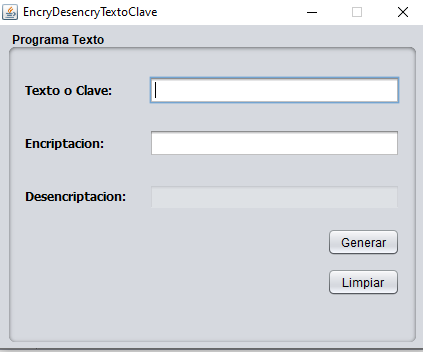

# Encriptar - Desencriptar Texto en Java

## _Descripcion del programa:_
- Programa para encriptar y desencriptar  texto o claves en MD5 BASE 64 realizado en formulario JAVA.

## _Vista del sistema:_

## _Realizado por:_

# Github: @CarlChokSanc

## The MIT License (MIT)

### Este programa o sistema puede ser tomado como guia o enseñanza para sus futuros  proyectos.
Copyright (c) 2021 harlericho
